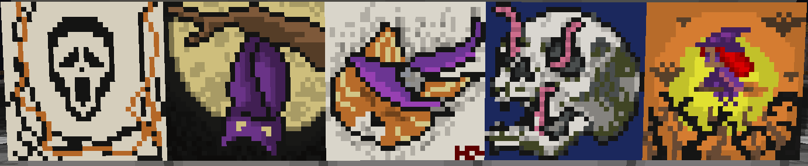

# Halloween Artmap Contest

## Art Map Contest

This Halloween we are going to try a new contest we have never tried before. As you can tell by the title of this section, that is correct a Halloween Art Map contest. If you're interested in participating in this event, continue reading for all the details on how to enter, when it ends, and what the winners will obtain.

If you are familiar with Art Map and how it works, please click [here](../../../servers/towny/art-map.md) to review our guide on how to get started creating your first art piece.&#x20;

### How to Enter **& Win**

Start by making a Halloween art masterpiece. When saving your final art masterpiece simply save it with HE in the front of the title_._ For example `/artmap save HE_<artwork title>`. Players are allowed only **one** entry. Any players with multiple entries/artwork save with HE\_ in the front will be disqualified.&#x20;


In order to run the save command, players need to be sitting at the easel they want to enter.&#x20;


The best way to win is by creating the best art you can on **one single map** that is Halloween-themed!&#x20;

.png>)

### Prizes

* **1st:** x1 Rare Key, $100,000 in-game money, 10,000 cosmetic coins
* **2nd:  x1 Common Key,** $50,000 in-game money, 5,000 cosmetic coins
* **3rd: x1 Vote Key,** $25,000 in-game money, 2,500 cosmetic coins

### Start & End Date

The event starts on Oct. 27th and ends on Nov. 1st, 2021. Staff will pick the 3 winners on the 1st of Nov.

### Winners & Entries

| Player Name       | Place  | Submitted Artmap |
| ----------------- | ------ | ---------------- |
| Wrenie            | First  | Broom/Witch Girl |
| I\_LikeTeddyBears | Second | Worm Skull       |
| EliasHZ           | Third  | Spooky Cat       |

