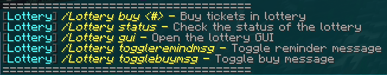

# Lottery

The lottery is a community event that is continuously being drawn every hour.&#x20;


The number of tickets you can buy depends on your rank.


### <mark style="color:yellow;">Player Ranks</mark>&#x20;

| Player Rank | Number of Buyable Tickets |
| :---------: | :-----------------------: |
|   Peasant   |             1             |
|   Citizen   |             1             |
|    Farmer   |             2             |
|   Servant   |             2             |
|  Apprentice |             3             |
|   Merchant  |             3             |
|    Squire   |             4             |
|    Noble    |             4             |
|     Lord    |             5             |
|   Viscount  |             5             |

### <mark style="color:purple;">Donator Ranks</mark>

|   Donator Ranks   | Number of Buyable Tickets |
| :---------------: | :-----------------------: |
|       Knight      |             6             |
|   Duke / Duchess  |             7             |
| Prince / Princess |             8             |
|    King / Queen   |             9             |
| Emperor / Empress |             10            |

### Lottery Commands

