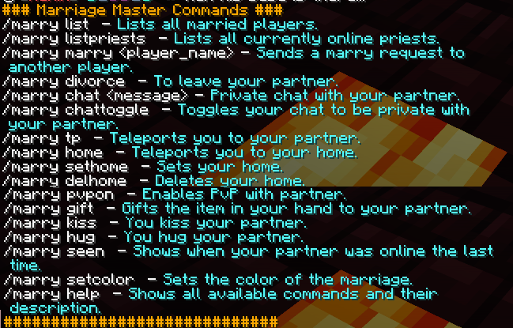

# Marriage

Marry in-game with your significant other / friend / teammate / whoever they are in your life to make things easier for you both. _<mark style="color:purple;">**Teamwork makes the dream work!**</mark>_

### Marry Commands

#### <mark style="color:orange;">What are Priests?</mark>

Priests are people that could force marry and/or divorce two people <mark style="color:green;">(This feature is disabled)</mark>.

#### <mark style="color:orange;">Notes:</mark>

* You must be within <mark style="color:green;">25 blocks in range</mark> of someone you want to <mark style="color:blue;">marry or divorce</mark>.
* <mark style="color:blue;">/marry kiss</mark> <mark style="color:yellow;"></mark> can also be done by crouching + right click. You must be within <mark style="color:blue;"></mark> <mark style="color:green;">2 blocks range.</mark>&#x20;
* <mark style="color:blue;">/marry gift</mark> <mark style="color:yellow;"></mark> is only possible when you and your partner are in the <mark style="color:green;">same world</mark>.&#x20;
* <mark style="color:blue;">/marry sethome</mark> is <mark style="color:red;">not</mark> a substitute for a town. It is <mark style="color:red;">not</mark> protected but just an added sethome.
* <mark style="color:blue;">/marry setcolor</mark> changes the color of the heart shown on <mark style="color:yellow;"></mark> <mark style="color:blue;">/marry list</mark><mark style="color:yellow;">.</mark> This is just for cosmetic purposes.&#x20;

