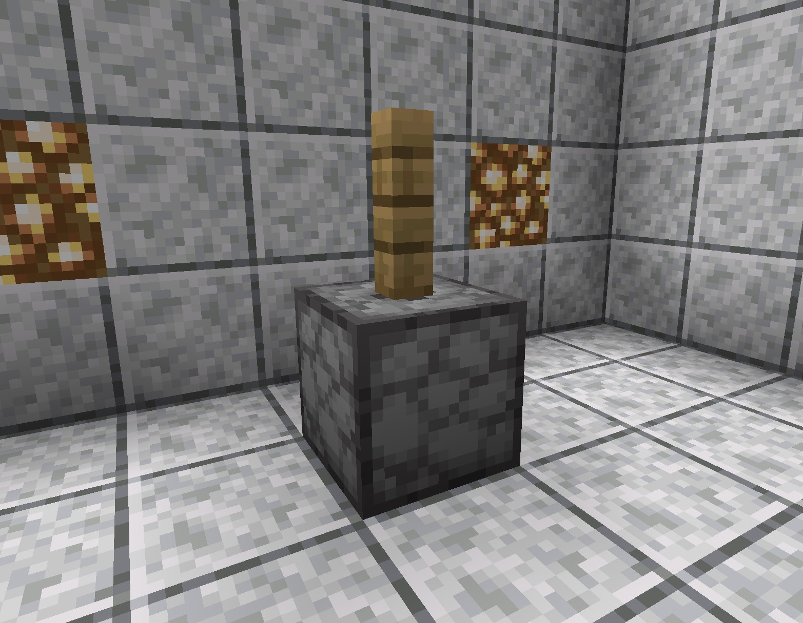

# Grind Stone

## Description

The Grind Stone is one of the [Basic Machines](https://app.gitbook.com/@royalemc/s/wiki/\~/drafts/-MWDZepKxc0SQCoYqQ2W/slimefun-and-add-ons/slimefun/basic-machines) within Slimefun. It's used to grind items down into other items. For example, you can grind a blaze rod into 4 blaze powder.&#x20;

.png>)


The Grind Stone is a [multiblock](../../commands/mutiblocks.md) structure which means its not crafted and needs to be built.


## Building & Recipe

You can find the recipe within your Slimefun Guide at anytime within game by running command `/sf search Grind Stone`

.png>)

**Items Needed:**\
****- x1 Fence\
\- x1 Dispenser (Facing Upwards)

To build it, you need to place a [Dispenser ](https://minecraft.gamepedia.com/Dispenser)**facing upwards** and one [Fence ](https://minecraft.gamepedia.com/Fence)of **any** kind put on top of it.&#x20;


Building the Grind Stone



The Dispenser must be facing **Upwards**.  If the Dispenser is in the incorrect orientation, the [multiblock](../../commands/mutiblocks.md) will not be valid.


## Usage

The materials are put in the dispenser and then right-click on the fence to activate the machine. The ground material will appear inside the dispenser.


Grinding a Blaze Rod into Blaze Powder using the Grind stone



You can use an [Output Chest](output-chest.md) next to the Dispenser to automatically collect your crafted items. Click [here](output-chest.md) for more information about the Output Chest.


## Recipes

| Input                                     | Output                                                                       |
| ----------------------------------------- | ---------------------------------------------------------------------------- |
| x1 Blaze Rod                              | x4 Blaze Powder                                                              |
| x1 Bone                                   | x4 Bone Meal                                                                 |
| x1 Bone Block                             | x9 Bone Meal                                                                 |
| x1 Eye of Ender                           | x2[ Ender Lump I](../magical-items/magical-lumps/ender-lump-i.md)            |
| x1 Andesite                               | x1 Gravel                                                                    |
| x1 Cobblestone                            | x1 Gravel                                                                    |
| x1 Diorite                                | x1 Gravel                                                                    |
| x1 Granite                                | x1 Gravel                                                                    |
| x1 Sandstone                              | x4 Sand                                                                      |
| x1 Red Sandstone                          | x4 Red Sand                                                                  |
| x1 Prismarine Bricks                      | x2 Prismarine                                                                |
| x1 Prismarine                             | x4 Prismarine Shard                                                          |
| x1 Nether Wart Block                      | x9 Nether Wart                                                               |
| x1 Nether Wart                            | x2 [Magical Lump I](../magical-items/magical-lumps/magical-lump-i.md)        |
| x1 Wheat                                  | x1 [Wheat Flour](../miscellaneous-items/wheat-flour.md)                      |
| x1 Ice                                    | x4 [Ice Cube](../../add-ons/exotic-garden/ingredients-and-tools/ice-cube.md) |
| x1 Egg                                    | x1 [Mayo](../../add-ons/exotic-garden/ingredients-and-tools/mayo.md)         |
| x1 Mustard Seed                           | x1 [Mustard](../../add-ons/exotic-garden/ingredients-and-tools/mustard.md)   |
| x1 Corn                                   | x1 C[ornmeal](../../add-ons/exotic-garden/ingredients-and-tools/cornmeal.md) |
| x1 Programmable Android (normal)          | x8 Machine Scrap                                                             |
| x1 Advanced Programmable Android (normal) | x8 Advanced Machine Scrap                                                    |
| x1 Stardust Meteor                        | x1 Star Dust                                                                 |
| x4 Netherrack                             | 
x1 Knarf Pellet <strong></strong>
                                  |
